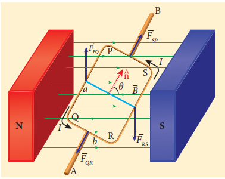
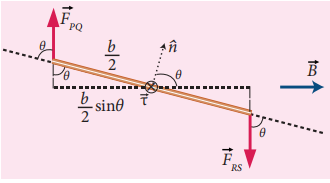
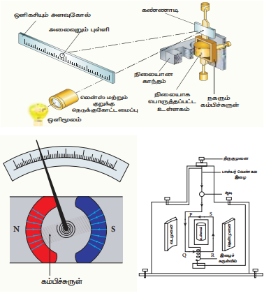
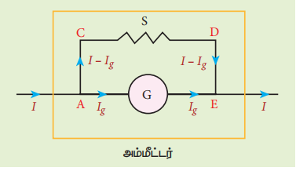
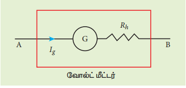

## 3.11 மின்னோட்டச் சுற்றின் மீது செயல்படும் திருப்பு விசை

காந்தப்புலத்திலுள்ள மின்னோட்டம் பாயும் கடத்தியின் மீது செயல்படும் விசை, விசைப்பொறி (motor) ஒன்றின் செயல்பாட்டிற்கு அடிப்படையாக அமைகிறது.

### காந்தப்புலத்திலுள்ள மின்னோட்டச் சுற்றின் மீது செயல்படும் திருப்பு விசை

சீரான காந்தப்புலம் $\vec{B}$ ல் வைக்கப்பட்டுள்ள மின்னோட்டம் I பாயும் செவ்வகச் சுருள் PQRS-ஐக் கருதுக. சுருளின் நீளம் மற்றும் அகலம் முறையே a மற்றும் b என்க. படம் 3.57ல் காட்டியுள்ளபடி சுருளின் தளத்திற்கு செங்குத்தாக வரையப்பட்ட ஓரலகு வெக்டர் $\hat{n}$ காந்தப்புலத்திற்கு $\theta$ கோணத்தில் உள்ளது.

படம் 3.57 காந்தப்புலத்தில் உள்ள செவ்வகக் கம்பிச்சுருள்

மின்னோட்டம் தாங்கிய பகுதி PQ ன் மீது செயல்படும் விசையின் எண்மதிப்பு $F_{PQ} = I a B \sin \frac{\pi}{2} = I a B$. இது மேல்நோக்கிய திசையில் செயல்படுகிறது என்பதை வலக்கைத் திருகு விதியைப் பயன்படுத்தி அறியலாம்.

பகுதி QR மீது செயல்படும் விசையின் எண்மதிப்பு $F_{QR} = I b B \sin \left(\frac{\pi}{2} + \theta\right) = I b B \cos \theta$. இவ்விசையின் திசை படம் 3.57ல் காட்டப்பட்டுள்ளது.

பகுதி RS மீது செயல்படும் விசையின் எண்மதிப்பு $F_{RS} = I a B \sin \frac{\pi}{2} = I a B$. இவ்விசை கீழ்நோக்கிய திசையில் செயல்படுகிறது.

பகுதி SP மீது செயல்படும் விசையின் எண்மதிப்பு $F_{SP} = I b B \sin \left(\frac{\pi}{2} + \theta\right) = I b B \cos \theta$. இவ்விசையின் திசை படம் 3.57ல் காட்டப்பட்டுள்ளது.

$F_{QR}$ மற்றும் $F_{SP}$ ஆகிய இவ்விரு விசைகள் சமமாகவும் ஒன்றுக்கொன்று எதிர்த்திசையில் அமைந்து ஒரே நேர்க்கோட்டிலும் செயல்படுவதால் அவை ஒன்றையொன்று சமன் செய்துவிடுகின்றன. ஆனால், $F_{PQ}$ மற்றும் $F_{RS}$ ஆகிய இவ்விரு விசைகள் சமமாகவும் ஒன்றுக்கொன்று எதிர்த்திசையில் இருந்தாலும் ஒரே நேர்க்கோட்டில் செயல்படாததால், அவை இரட்டையை உருவாக்கி வளையத்தின் மீது ஒரு திருப்புவிசையை செலுத்துகின்றன.

படம் 3.58 மின்னோட்ட வளையத்தின் பக்கவாட்டுத் தோற்றம்

அச்சு ABஐப் பொறுத்து பகுதி PQன் மீது செயல்படும் திருப்புவிசையின் எண்மதிப்பு

$$\tau_{PQ} = \frac{b}{2} F_{PQ} \sin \theta = \frac{b}{2} (I a B) \sin \theta$$

இது AB திசையில் செயல்படுகின்றது. அச்சு ABஐப் பொறுத்து பகுதி RSன் மீது செயல்படும் திருப்புவிசையின் எண்மதிப்பு

$$\tau_{RS} = \frac{b}{2} F_{RS} \sin \theta = \frac{b}{2} (I a B) \sin \theta$$

மேலும் இதுவும் ABன் திசையிலேயே செயல்படுகின்றது (படம் 3.58).

அச்சு ABஐப் பொறுத்து வளையத்தின் மீது செயல்படும் மொத்த திருப்புவிசை

$$\tau = \frac{b}{2} F_{PQ} \sin \theta + \frac{b}{2} F_{RS} \sin \theta = I a B b \sin \theta = I A B \sin \theta$$

இது ABன் திசையில் செயல்படுகிறது.

வெக்டர் வடிவில், $\vec{\tau} = (I \vec{A}) \times \vec{B}$

மேலேயுள்ள சமன்பாட்டினை காந்த இருமுனை திருப்புத்திறனின் அடிப்படையில் எழுதினால்,

$$\vec{\tau} = \vec{p}_m \times \vec{B}$$

இங்கு $\vec{p}_m = I \vec{A}$

இத்திருப்புவிசை வளையத்தை சுழலச் செய்து அதன் ஓரலகு செங்குத்து வெக்டரை காந்தப்புலத்தின் திசையில் ஒருங்கமைக்கும் விதத்தில் செயல்படுகின்றது.

செவ்வக வளையத்தில் N சுற்றுகள் இருப்பின், திருப்புவிசை, $\tau = N I A B \sin \theta$

**சிறப்பு நேர்வுகள்:**

(அ) $\theta = 90^\circ$ அல்லது வளையத்தின் தளம் காந்தப்புலத்திற்கு இணையாக உள்ளபோது, மின்னோட்ட வளையத்தின் மீதான திருப்புவிசை பெருமம் ஆகும்.

$$\tau_{\max} = I A B$$

(ஆ) $\theta = 0^\circ / 180^\circ$ அல்லது வளையத்தின் தளம் காந்தப்புலத்திற்கு செங்குத்தாக உள்ளபோது, மின்னோட்ட வளையத்தின் மீதான திருப்புவிசை சுழியாகும்.

### 3.11.2 இயங்கு சுருள் கால்வனோமீட்டர்

ஒரு மின்சுற்றின் வழியே பாயும் மின்னோட்டத்தைக் கண்டறியப் பயன்படும் ஒரு கருவி, இயங்கு சுருள் கால்வனோமீட்டராகும்.

**தத்துவம்**

மின்னோட்டம் பாயும் வளையம் ஒன்றை சீரான காந்தப்புலத்தில் வைக்கும்போது அது ஒரு திருப்புவிசையை உணரும்.

**அமைப்பு**

இயங்கு சுருள் கால்வனோ மீட்டரில், மெல்லிய காப்பிடப்பட்ட தாமிரக் கம்பியால் சுற்றப்பட்ட செவ்வக வடிவ கம்பிச்சுருள் PQRS ஒன்று உள்ளது. அதிக சுற்றுக்களை உடைய இக்கம்பிச்சுருள் இலேசான உலோகச் சட்டத்தின் மீது நெருக்கமாக சுற்றப்பட்டுள்ளது. படம் 3.59 இல் காட்டியுள்ளவாறு உருளைவடிவ தேனிரும்பு உள்ளகம் ஒன்று கம்பிச்சுருளின் உள்ளே சமச்சீராகப் பொருந்தப்பட்டுள்ளது. இந்த செவ்வக வடிவ கம்பிச்சுருள் குதிரைலாட காந்தத்தின் இரண்டு முனைகளுக்கு நடுவே தடையின்றி தொங்கவிடப்பட்டுள்ளது.

படம் 3.59 இயங்கு சுருள் கால்வனோமீட்டர் மற்றும் அதன் பாகங்கள்

செவ்வகக் கம்பிச்சுருளின் மேல்முனை பாஸ்பர் வெண்கல இழையினால் பிணைக்கப்பட்டுள்ளது. இதேபோன்று கம்பிச்சுருளின் கீழ்முனை பாஸ்பர் வெண்கலத்தால் செய்யப்பட்ட இழைச் சுருள் வில்லுடன் பிணைக்கப்பட்டுள்ளது. மெல்லிய தொங்கு இழையில் சிறிய சமதள ஆடி ஒன்று பொருந்தப்பட்டுள்ளது. விளக்கு மற்றும் அளவுகோல் அமைப்பின் உதவியுடன் இந்த சமதள ஆடியைப் பயன்படுத்தி கம்பிச்சுருளில் ஏற்படும் விலகலை அளவிடலாம். அதன் மறுமுனை ஒரு திருகுமுனையுடன் இணைக்கப்பட்டுள்ளது. கம்பிச்சுருள் வழியே மின்னோட்டத்தைச் செலுத்த மெல்லிய கம்பி இழை மற்றும் இழைச்சுருள் வில் S ஆகியவை மின்முனைகளுடன் இணைக்கப்பட்டுள்ளன.

**வேலை செய்யும் முறை**

l நீளமும் b அகலமும் கொண்ட PQRS செவ்வக கம்பிச்சுருளின் ஒரே ஒரு சுற்றை மட்டும் கருதுவோம். $PQ = RS = l$ மற்றும் $QR = SP = b$. I என்ற மின்னோட்டம் கம்பிச்சுருள் PQRS வழியே படம் 3.60 இல் காட்டியுள்ளவாறு பாய்கிறது என்க. குதிரைலாட வடிவ காந்தத்தில் அரைக்கோள காந்த முனைகள் உள்ளன. இவை ஓர் ஆரவகை காந்தப்புலத்தைத் (Radial magnetic field) தொற்றுவிக்கும். இந்த ஆரவகை காந்தப்புலத்தினால் QR மற்றும் SP பக்கங்கள் எப்போதும் காந்தப்புலத்திற்கு B இணையாக இருக்கும். மேலும் எவ்வித விசையையும் உணராது. PQ மற்றும் RS பக்கங்கள் எப்பொழுதும் காந்தப்புலத்திற்கு B செங்குத்தாக இருப்பதால் விசையை உணரும். இக்காரணத்தினால் திருப்பு விசை ஏற்படும்.

படம் 3.60 மின்னோட்டம் பாயும் கம்பிச்சுருளின் மீது செயல்படும் விசை

கம்பிச்சுருளின் ஒரு சுற்றுக்கு, விலகு இரட்டை

$$\tau = b F = b (B I l) = (I b l) B = I A B$$

இங்கு கம்பிச்சுருளின் பரப்பு $A = I b$. எனவே N சுற்றுகள் கொண்ட கம்பிச்சுருளுக்கு நாம் பெறுவது

$$\tau = N A B I \qquad (3.69)$$

இந்த விலகு திருப்புவிசையினால் கம்பிச்சுருள் முறுக்கப்பட்டு, கம்பியில் ஓர் மீட்சி திருப்புவிசை (restoring torque) (மீட்சி இரட்டை என்றும் அழைக்கலாம்) உருவாகும். எனவே மீட்சி இரட்டையின் எண்மதிப்பு, முறுக்குக் கோணம் $\theta$ விற்கு நேர்த்தகவில் இருக்கும். எனவே

$$\tau_{\text{மீட்சி}} = K \theta \qquad (3.70)$$

இங்கு K என்பது ஓரலகு முறுக்கத்திற்கான மீட்சி இரட்டை அல்லது சுருள்வில்லின் முறுக்குமாறிலி ஆகும்.

சமநிலையில், விலகு இரட்டை மீட்சி இரட்டைக்குச் சமமாகும். எனவே,

$$N A B I = K \theta$$

$$\implies I = \frac{K}{N A B} \theta \quad (\text{அல்லது}) \quad I = G \theta \qquad (3.71)$$

இங்கு $G = \frac{K}{N A B}$ என்பது கால்வனோமீட்டர் மாறிலி அல்லது கால்வனோமீட்டரின் மின்னோட்ட சுருக்கக் கூற்நெண் எனப்படும்.

தொங்கவிடப்பட்ட இயங்கு சுருள் கால்வனோமீட்டர் மிகவும் உணர்திறன் (Sensitivity) வாய்ந்ததாகும். மிக்க கவனத்துடன் இதனைக் கையாள வேண்டும். நாம் பயன்படுத்தும் பெரும்பான்மையான கால்வனோமீட்டர்கள் குறிமுள் வகை கால்வனோ மீட்டர்களாகும்.

**கால்வனோமீட்டரின் தகுதியொப்பெண்**

கால்வனோமீட்டர் அளவுகோலின் ஒரு பிரிவுக்கான விலகலை ஏற்படுத்தும் மின்னோட்டத்தின் அளவே, கால்வனோ மீட்டரின் தகுதியாப்பெண் என வரையறுக்கப்படுகிறது.

**கால்வனோமீட்டரின் உணர்திறன்**

**மின்னோட்ட உணர்திறன்:** கால்வனோ மீட்டர் வழியே பாயும் ஓரலகு மின்னோட்டத்திற்கு ஏற்படும் விலகல் அதன் மின்னோட்ட உணர்திறன் எனப்படும்.

$$I_s = \frac{\theta}{I} = \frac{N A B}{K} \implies I_s = \frac{1}{G} \qquad (3.72)$$

கால்வனோ மீட்டரின் மின்னோட்ட உணர்திறனை பின்வரும் வழிமுறைகளில் அதிகரிக்கலாம்.
(1) சுற்றுகளின் எண்ணிக்கையை அதிகரிப்பதனால் (N)
(2) காந்தப்புலம் B யை அதிகரிப்பதனால்
(3) கம்பிச் சுருளின் பரப்பு A வை அதிகரிப்பதனால்
(4) கம்பிச்சுருளைத் தொங்கவிடப் பயன்படும் இழையின் ஓரலகு முறுக்கத்திற்கான இரட்டையை K குறைப்பதன் மூலம் மின்னோட்ட உணர்திறனை அதிகரிக்கலாம்.

இங்கு பாஸ்பர் வெண்கல இழை கம்பிச்சுருளை தொங்கவிடப் பயன்படுத்தப்படுகிறது. ஏனெனில் இதன் ஓரலகு முறுக்கத்திற்கான இரட்டையின் மதிப்பு மிகக் குறைவானதாகும்.

**மின்னழுத்த வேறுபாட்டு உணர்திறன்:** கால்வனோமீட்டரின் முனைகளுக்கிடையே அளிக்கப்படும் ஓரலகு மின்னழுத்த வேறுபாட்டிற்குரிய விலகல், அதன் மின்னழுத்த வேறுபாட்டு உணர்திறன் எனப்படும்.

$$V_s = \frac{\theta}{V} = \frac{\theta}{I R_g} = \frac{N A B}{K R_g} \implies V_s = \frac{1}{G R_g} = \frac{I_s}{R_g} \qquad (3.73)$$

இங்கு $R_g$ என்பது கால்வனோமீட்டரின் மின்தடையாகும்.

**எடுத்துக்காட்டு 3.25**

ஒரு இயங்கு சுருள் கால்வனோமீட்டர் ஒன்றின் கம்பிச்சுருளின் சுற்றுகளின் எண்ணிக்கை ஐந்து. ஒவ்வொரு சுற்றின் நிகர பரப்பும் $2 \times 10^{-2} m^2$. இக்கம்பிச்சுருள் $4 \times 10^{-2} Wb m^{-2}$ வலிமை கொண்ட காந்தப்புலம் ஒன்றினுள் $4 \times 10^{-9} N m deg^{-1}$ முறுக்கு மாறிலி K கொண்ட இழையினால் தொங்கவிடப்பட்டுள்ளது.

(அ) கால்வனோமீட்டரின் மின்னோட்ட உணர்திறனை டிகிரி / மைக்ரோ – ஆம்பியரில் காண்க.
(ஆ) 50 பிரிவுகள் கொண்ட அளவுகோலின் முழு விலக்கத்திற்கான மின்னழுத்தம் 25 mV என்ற நிபந்தனையில் அதன் மின்னழுத்த உணர்திறனைக் காண்க.
(இ) கால்வனோமீட்டரின் மின்தடையைக் காண்க.

**தீர்வு**

கம்பிச் சுருளின் சுற்றுகளின் எண்ணிக்கை $N = 5$
ஒவ்வொரு சுற்றும் $A = 2 \times 10^{-2} m^2$ பரப்பு கொண்டது.
காந்தப்புலத்தின் வலிமை $B = 4 \times 10^{-2} Wb m^{-2}$
கம்பிச்சுருளைத் தொங்கவிடப் பயன்படும் இழையின் முறுக்கு மாறிலி $K = 4 \times 10^{-9} N m deg^{-1}$

(அ) மின்னோட்ட உணர்திறன்
$$I_s = \frac{N A B}{K} = \frac{5 \times 2 \times 10^{-2} \times 4 \times 10^{-2}}{4 \times 10^{-9}} = \frac{40 \times 10^{-4}}{4 \times 10^{-9}} = 10^6 \text{ பிரிவுகள் / ஆம்பியர்}$$

1 µA = 1 மைக்ரோ ஆம்பியர் = $10^{-6}$ ஆம்பியர். எனவே,
$$I_s = \frac{10^6 \text{ பிரிவு}}{A} = \frac{10^6 \text{ பிரிவு}}{10^6 \mu A} = 1 \text{ பிரிவு} (\mu A)^{-1}$$

(ஆ) மின்னழுத்த வேறுபாட்டு உணர்திறன்
$$V_s = \frac{\theta}{V} = \frac{50 \text{ பிரிவு}}{25 \text{ mV}} = 2 \times 10^3 \text{ பிரிவு} V^{-1}$$

(இ) கால்வனோ மீட்டரின் மின்தடை
$$R_g = \frac{I_s}{V_s} = \frac{10^6 \text{ பிரிவு}/A}{2 \times 10^3 \text{ பிரிவு}/V} = 0.5 \times 10^3 \ \Omega = 500 \ \Omega$$

**எடுத்துக்காட்டு 3.26**

கால்வனோமீட்டரின் மின்னோட்ட உணர்திறனை 50% அதிகரிக்கும்போது, அதன் மின்தடை, தொடக்க மின்தடையைப் போன்று இருமடங்காகிறது. இந்த நிபந்தனையில் கால்வனோமீட்டரின் மின்னழுத்த உணர்திறன் மாறுமா? அவ்வாறு மாற்றமடைந்தால் எவ்வளவு மாற்றமடையும்?

**தீர்வு**

ஆம், மின்னழுத்த வேறுபாட்டு உணர்திறன் மாற்றமடையும்.

$I_s' = 1.5 I_s$ (50% அதிகரிப்பு)

கால்வனோ மீட்டரின் மின்தடை $R_g$ இருமடங்காக்கப்பட்டால், புதிய மின்தடை $R_g' = 2 R_g$

மின்னோட்ட உணர்திறனில் ஏற்பட்ட அதிகரிப்பு $I_s' = \frac{N A B}{K'} \implies K' = \frac{K}{1.5}$

புதிய மின்னழுத்த வேறுபாட்டு உணர்திறன் $V_s' = \frac{I_s'}{R_g'} = \frac{1.5 I_s}{2 R_g} = 0.75 \frac{I_s}{R_g} = 0.75 V_s$

எனவே, மின்னழுத்த வேறுபாட்டு உணர்திறன் குறையும். மின்னழுத்த வேறுபாட்டு உணர்திறனின் சதவிகிதக் குறைவு

$$\frac{V_s - V_s'}{V_s} \times 100\% = 25\%$$

**கால்வனோமீட்டரை அம்மீட்டர் மற்றும் வோல்ட்மீட்டராக மாற்றுதல்**

மின்னோட்டத்தைக் கண்டறியும் கால்வனோ மீட்டர் ஓர் உணர்திறன் வாய்ந்த கருவியாகும். இதனை எளிமையாக அம்மீட்டர் (Ammeter) மற்றும் வோல்ட்மீட்டராக (Voltmeter) மாற்றலாம்.

**கால்வனோமீட்டரை அம்மீட்டராக மாற்றுதல்**

மின்சுற்றில் பாயும் மின்னோட்டத்தை அளக்கப் பயன்படும் கருவியை அம்மீட்டராகும். அம்மீட்டர் மின்சுற்றில் பாயும் மின்னோட்டத்திற்கு மிகக் குறைந்த மின்தடையையே கொடுப்பதால் இது மின்சுற்றில் பாயும் மின்னோட்டத்தைத் தடுக்காது. எனவே மின்சுற்றில் பாயும் மின்னோட்டத்தை அளக்க, அம்மீட்டரை மின்சுற்றில் தொடரிணைப்பில் இணைக்க வேண்டும்.

படம் 3.61 இணைத்த மின்தடை கால்வனோமீட்டருக்கு பக்க இணைப்பில் இணைக்கப்பட்டுள்ளது

கால்வனோமீட்டரை அம்மீட்டராக மாற்ற, அந்த கால்வனோ மீட்டருடன் குறைந்த மின்தடை ஒன்றை பக்க இணைப்பில் இணைக்க வேண்டும். இக்குறைந்த மின்தடைக்கு இணைதட மின்தடை (Shunt resistance) S என்று பெயர். கால்வனோமீட்டரின் அளவுகோல் இப்போது ஆம்பியரில் குறிக்கப்பட்டு, அம்மீட்டரின் நெடுக்கம் இணைதட மின்தடையின் மதிப்பைப் பொறுத்து அமைகிறது.

மின்சுற்றில் பாயும் மின்னோட்டம் I என்க. இம்மின்னோட்டம் A சந்தியை அடையும்போது இரு கூறுகளாகப் பிரிகிறது. இது படம் 3.61 இல் காட்டப்பட்டுள்ளது. AGE என்ற பாதை வழியே, $R_g$ மின்தடை கொண்ட கால்வனோமீட்டர் வழியே பாயும் மின்னோட்டத்தை $I_g$ என்க. இணைத மின்தடை S வழியே ACDE பாதை வழியே பாயும் மின்னோட்டம் $(I - I_g)$ என்க. இணைத மின்தடையை சரிசெய்து முழு அளவுகோல் விலக்கத்தைக் காட்டும் வகையில் கால்வனோமீட்டர் வழியே பாயும் மின்னோட்டத்தை $I_g$ சரி செய்ய வேண்டும். கால்வனோமீட்டருக்குக் குறுக்கே உள்ள மின்னழுத்த வேறுபாடும், இணைத மின்தடைக்குக் குறுக்கே உள்ள மின்னழுத்த வேறுபாடும் ஒன்றுக்கொன்று சமமாகும்.

$$V_{\text{கால்வனோமீட்டர்}} = V_{\text{இணைதம்}}$$

$$\implies I_g R_g = (I - I_g) S$$

$$S = \frac{I_g}{(I - I_g)} R_g \quad (\text{அல்லது}) \quad I_g = \frac{S}{S + R_g} I \implies I_g \propto I$$

எனவே கால்வனோமீட்டரில் ஏற்படும் விலக்கம், அதன் வழியே பாயும் மின்னோட்டத்திற்கு நேர்த்தகவில் இருக்கும்.

எனவே கால்வனோமீட்டரில் ஏற்படும் விலக்கம், மின்சுற்றின் வழியே பாயும் மின்னோட்டத்தை அளக்கும் (அம்மீட்டர்) கருவியாக செயல்படும்.

இணைதட மின்தடை கால்வனோமீட்டருக்கு பக்க இணைப்பாக இணைக்கப்பட்டுள்ளது. எனவே, தொகுப்பன் மின்தடையை கணக்கிடுவதன் மூலம் அம்மீட்டரின் மின்தடையைக் கணக்கிடலாம்.

$$\frac{1}{R_{\text{தொகுப்பன்}}} = \frac{1}{R_g} + \frac{1}{S} \implies R_{\text{தொகுப்பன்}} = \frac{R_g S}{R_g + S} = R_a$$

இங்கு இணைத்தடத்தின் மின்தடை மதிப்பு மிகக்குறைவு. எனவே, S இன் விகிதமும் $R_g$ குறைவாகவே இருக்கும். இதன்பொருள் $R_a$ மதிப்பும் குறைவு என்பதாகும். அதாவது அம்மீட்டர் மின்சுற்றில் பாயும் மின்னோட்டத்திற்கு குறைவான மின்தடையையே அளிக்கும். எனவே மின்சுற்றில் அம்மீட்டரை தொடராக இணைக்கும்போது சுற்றின் மின்தடை மற்றும் மின்னோட்டத்தில் குறிப்பிடத்தக்க மாற்றம் எதையும் ஏற்படுத்தாது. ஒரு நல்வியல்பு அம்மீட்டரின் மின்தடை சுழியாகும். ஆனால் நடைமுறையில் அம்மீட்டர் காட்டும் மின்னோட்டத்தின் அளவு, மின்சுற்றில் பாயும் மின்னோட்டத்தின் அளவைவிடச் சற்றே குறைவாகவே இருக்கும்.

$I_{\text{நல்வியல்}}$ என்பது நல்லியல்பு அம்மீட்டர் அளக்கும் மின்னோட்டம் எனவும் $I_{\text{அயல்பு}}$ என்பது அம்மீட்டர் அளக்கும் மின்சுற்றில் பாயும் மின்னோட்டம் எனவும் கொண்டால்

$$\frac{\Delta I}{I} \times 100\% = \frac{I_{\text{நல்வியல்}} - I_{\text{அயல்பு}}}{I_{\text{நல்வியல்}}} \times 100\%$$

**முக்கியக் குறிப்புகள்**

1. அம்மீட்டர் குறைந்த மின்தடை கொண்ட ஒரு கருவியாகும். இதனை எப்போதும் மின்சுற்றில் தொடராகவே இணைக்க வேண்டும்.
2. ஒர் நல்வியல் அம்மீட்டர் சுழி மின்தடையைப் பெற்றிருக்கும்.
3. அம்மீட்டரின் நெடுக்கத்தை n மடங்கு அதிகரிக்க, பக்க இணைப்பில் இணைக்க வேண்டிய இணைதட மின்தடையின் மதிப்பு $S = \frac{R_g}{(n-1)}$ ஆகும்.

**கால்வனோமீட்டரை வோல்ட்மீட்டராக மாற்றுதல்**

மின்சுற்றில் ஏதேனும் இரண்டு புள்ளிகளுக்கு இடையே உள்ள மின்னழுத்த வேறுபாட்டை அளவீடு செய்யப் பயன்படும் கருவியே வோல்ட்மீட்டராகும். வோல்ட்மீட்டர் மின்சுற்றிலிருந்து எவ்விதமான மின்னோட்டத்தையும் பெறாது. அவ்வாறு மின்னோட்டத்தைப் பெற்றால் வோல்ட்மீட்டர் அளவிடும் மின்னழுத்தத்தில் மாற்றம் ஏற்பட்டு விடும்.

படம் 3.62 தொடராக இணைக்கப்பட்ட உயர் மின்தடை

வோல்ட்மீட்டர் உயர்ந்த மின்தடையைப் பெற்றிருக்க வேண்டும். இதனை மின்சுற்றில் பக்க இணைப்பில் இணைக்கும்போது, அப்பகுதிக்கு மின்னோட்டம் எடுத்துச் செல்லும் வழியாக மாற்று வழி ஒன்றை ஏற்படுத்தாது. எனவே இது உண்மையான மின்னழுத்த வேறுபாட்டையே காட்டும்.

ஒரு கால்வனோமீட்டரை வோல்ட்மீட்டராக மாற்ற, கால்வனோமீட்டருடன் தொடரிணைப்பாக உயர் மின்தடை ஒன்றை இணைக்க வேண்டும். இது படம் 3.62 இல் காட்டப்பட்டுள்ளது. கால்வனோமீட்டரின் அளவீடுகள் இப்போது வோல்ட்டில் குறிக்கப்பட்டு, வோல்ட்மீட்டரின் நெடுக்கம் உயர் மின்தடையைச் சார்ந்து அமையும். அதாவது மின்னோட்டம் I கால்வனோ மீட்டரின் அளவுகோலின் முழு விலக்கத்தைக் காட்டும் வகையில், உயர் மின்தடையின் மதிப்பைச் சரிசெய்யப்படும்.

கால்வனோமீட்டரின் மின்தடை $R_g$ மற்றும் கால்வனோமீட்டரில் முழு விலக்கத்திற்கான மின்னோட்டம் $I_g$ என்க. இங்கு உயர் மின்தடையுடன் கால்வனோமீட்டர் தொடராக இணைக்கப்பட்டுள்ளது. எனவே மின்சுற்றில் பாயும் மின்னோட்டம், கால்வனோமீட்டர் வழியாக பாயும் மின்னோட்டத்திற்குச் சமமாகும்.

அதாவது $I = I_g \implies I_g = \frac{\text{மின்னழுத்த வேறுபாடு}}{\text{மொத்த மின்தடை}}$

கால்வனோமீட்டரும், உயர் மின்தடையும் தொடராக இணைக்கப்பட்டுள்ளதால், மொத்த மின்தடை அல்லது தொகுப்பன் மின்தடை வோல்ட்மீட்டரின் மின்தடையைக் குறிக்கும். வோல்ட்மீட்டரின் மின்தடை $R_v = R_g + R_h$ ஆகும்.

எனவே, $I_g = \frac{V}{R_g + R_h} \implies R_h = \frac{V}{I_g} - R_g$

இங்கு $I_g << V$ என்பதை கவனிக்கவும்.

கால்வனோமீட்டரில் ஏற்படும் விலக்கம் மின்னோட்டம் I க்கு நேர்த்தகவில் அமையும். ஆனால் மின்னோட்டம் I மின்னழுத்த வேறுபாட்டிற்கு நேர்த்தகவில் உள்ளதால் கால்வனோமீட்டரில் ஏற்படும் விலக்கம் மின்னழுத்த வேறுபாட்டிற்கு நேர்த்தகவில் இருக்கும். வோல்ட்மீட்டரின் மின்தடை மிக அதிகம். எனவே மிகக்குறைந்த மின்னோட்டத்தையே மின்சுற்றிலிருந்து வோல்ட்மீட்டர் பெறும். ஒரு நல்வியல் வோல்ட்மீட்டர் முடிவிலா மின்தடையைப் (Infinite resistance) பெற்றிருக்க வேண்டும்.

**முக்கியக் குறிப்புகள்**

1. வோல்ட்மீட்டரின் மின்தடை மிக அதிகம் என்பதால், மின்சுற்றில் எந்த பகுதியின் மின்னழுத்த வேறுபாட்டைக் கணக்கிட வேண்டுமோ அதற்குப் பக்க இணைப்பாக வோல்ட்மீட்டரை இணைக்க வேண்டும்.
2. ஒரு நல்வியல் வோல்ட்மீட்டர் முடிவிலா மின்தடையைப் பெற்றிருக்கும்.
3. வோல்ட்மீட்டரின் நெடுக்கத்தை n மடங்கு உயர்த்த, கால்வனோமீட்டருடன் தொடரிணைப்பில் இணைக்க வேண்டிய மின்தடையின் மதிப்பு $R_h = (n-1) R_g$ ஆகும்.